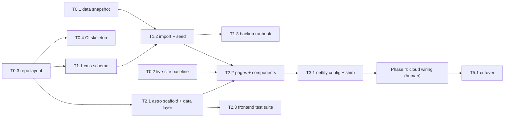

# Build Workflow: BrisJS Migration

> **Last updated:** 2026-06-11
> **Status:** active (board is live state during the build)
> **What this is:** the *dynamic workflow* for building features 001–004 — a dependency-driven
> task board plus the protocol any agent session follows to execute it. Unlike other docs in
> `docs/`, the **task board statuses are mutable working state**: every session updates them
> as gates pass. The phases/protocol text itself changes only by decision.

## Protocol (how a session executes this board)

Each iteration:

1. **Read the board.** Pick the highest-priority task whose `Depends on` are all `done` and
   whose status is `todo`, with `Owner: agent`.
2. **Parallelise when independent.** If several such tasks are ready, dispatch parallel
   subagents (max 3), each with a self-contained prompt naming the feature docs and the gate.
   T2.2's sub-tracks (a–d) are designed for exactly this.
3. **Build with TDD** per `docs/TEST_STRATEGY.md`; the task is not done until its **gate**
   (the referenced TEST_CASES) is green.
4. **One commit per task**, message prefixed with the task ID (e.g. `T2.1: …`).
5. **Update state:** flip the board status, and update `features/FEATURES.md` when a whole
   feature's tasks complete.
6. **Blocked?** Mark the task `blocked` with a one-line reason on the board, record the
   detail in the owning feature's Open Questions, and pick the next ready task.
7. **Stop conditions:** all `Owner: agent` tasks `done`/`blocked` → write `docs/HUMAN_TODO.md`
   summarising the Phase 4 checklist state, and stop.

**Hard rules:** never start feature 005 (deferred redesign); never attempt Strapi Cloud /
Netlify account actions or DNS (those are `Owner: human`); secrets only via env
(`STRAPI_API_URL` / `STRAPI_API_TOKEN`), never committed; port the current design — visual
parity against the T0.2 baseline is the bar, not improvement.

## Dependency Graph

## Task Board

Statuses: `todo` · `in-progress` · `blocked` · `done`

### Phase 0 — Baseline & foundations (all independent — run in parallel)

| ID | Task | Refs | Depends on | Gate | Status | Owner |
|----|------|------|-----------|------|--------|-------|
| T0.1 | Snapshot legacy data: fetch the talks TSV (`config.json` → `dataSources.talks`) into `data/legacy/talks.tsv`; probe the Meetup `sig` URL and record the result against HLD Open Q2 | 001/003 | — | snapshot committed; probe result recorded | done | agent |
| T0.2 | Capture the live-site baseline: screenshots of brisjs.org key pages (home, talks, a talk detail, jobs, contact, find-us) into `docs/baseline/` + Lighthouse scores (resolves NON_FUNCTIONAL Open Q1) | 002/005 | — | baseline files + scores committed | done | agent |
| T0.3 | Repo layout per ADR-006: create `web/` and `cms/` skeletons; root README note; legacy root untouched | ADR-006 | — | dirs exist; legacy unchanged | done | agent |
| T0.4 | CI skeleton: GitHub Actions running lint, typecheck, unit tests, and build on PRs | TEST_STRATEGY | T0.3 | workflow green on a no-op run | done | agent |

### Phase 1 — Content backbone

| ID | Task | Refs | Depends on | Gate | Status | Owner |
|----|------|------|-----------|------|--------|-------|
| T1.1 | Strapi project in `cms/` with all feature-001 content types as code (incl. `Organizer`, `HomePage`, `Talk.slug`/`legacyId`); draft & publish on; Public role read-only | 003 P-01 / 001 P-01 | T0.3 | 001 TC-01..04 against local Strapi | done | agent |
| T1.2 | Idempotent legacy importer; seed local Strapi from `data/legacy/talks.tsv` + `data/twitter.json` + `data/contact.json` (→ Organizer) + static copy from `index.html` (→ HomePage, CodeOfConduct, FindUs) | 001 P-03 / 003 P-03 | T1.1, T0.1 | 001 TC-05; 003 TC-05 (re-run = no dupes) | done | agent |
| T1.3 | Verify a Strapi export/restore round-trip locally and write the backup runbook (content exit path per ADR-002) | 003 FR-07 | T1.2 | export → wipe → restore reproduces the seeded content | done | agent |

### Phase 2 — Frontend (T2.1 can start in parallel with Phase 1, against fixtures)

| ID | Task | Refs | Depends on | Gate | Status | Owner |
|----|------|------|-----------|------|--------|-------|
| T2.1 | Astro scaffold in `web/` (TypeScript) + `src/lib/strapi` + typed `src/data/*` (port `lib/tsvTalks.js` grouping) + fixtures matching the 001 API shape | 002 P-01 | T0.3 | 002 TC-04 unit green; `astro build` works against fixtures | done | agent |
| T2.2 | All pages & components, current design ported. Parallel sub-tracks: **(a)** layout/nav/footer + home (HomePage copy + upcoming event), **(b)** talks archive + talk detail, **(c)** jobs + talk-requests + contact, **(d)** code-of-conduct + find-us | 002 P-02 | T2.1; full-content verification needs T1.2 | 002 TC-01..03; visual parity vs T0.2 baseline | done | agent |
| T2.3 | Frontend test suite + security checks (token-leak grep, fail-loud build) | 002 P-03 | T2.1 | 002 TC-05, TC-06 | done | agent |

### Phase 3 — Deploy configuration

| ID | Task | Refs | Depends on | Gate | Status | Owner |
|----|------|------|-----------|------|--------|-------|
| T3.1 | `netlify.toml` (`base = "web"`), legacy redirects, `#talk-<id>` client shim using a build-generated `legacyId → slug` map | 004 P-01 + shim from P-02 | T2.2 | 004 TC-06; local build green; shim unit-tested | done | agent |

### Phase 4 — Cloud wiring (human checkpoint)

| ID | Task | Refs | Depends on | Gate | Status | Owner |
|----|------|------|-----------|------|--------|-------|
| H4.1 | Create Strapi Cloud project + admin; deploy `cms/`; issue read-only API token; verify free-plan limits (001 Open Q4) | 003 P-01/P-02 | T1.1 | cloud API serves published content | todo | human |
| H4.2 | Connect Netlify project; set `STRAPI_API_URL`/`STRAPI_API_TOKEN` env; create build hook; enable deploy previews | 004 P-01/P-02 | T3.1, H4.1 | 004 TC-01, TC-07 | todo | human |
| H4.3 | Strapi webhook → Netlify build hook | 003 P-02 | H4.1, H4.2 | 003 TC-03; 004 TC-02 | todo | human + agent |
| H4.4 | Re-run the importer against cloud Strapi; spot-check vs the live old site | 003 P-03 | H4.1, T1.2 | 003 TC-05 | todo | agent (needs creds) |
| H4.5 | Domain/DNS: `brisjs.org` on the new deploy; reconcile the stale `CNAME` (HLD Open Q1) | 004 P-02 | H4.2 | 004 TC-05 | todo | human |

### Phase 5 — Cutover

| ID | Task | Refs | Depends on | Gate | Status | Owner |
|----|------|------|-----------|------|--------|-------|
| T5.1 | Compare deploy preview vs baseline; merge to `master`; remove legacy root files (cleanup commit per ADR-006); update HLD/ARCHITECTURE to the post-migration system; flip FEATURES statuses to `complete` | all | Phase 4 done | 004 TC-01..07 on production; docs in sync | todo | human + agent |

> Features **005 (design refresh)** and **006 (Meetup past-events enrichment)** start only
> after T5.1, as their own cycles on this board's successor — not part of this build.

## Verification (end-to-end, pre-Phase-4)

The autonomous portion is done when: `cms/` starts locally with seeded content; `npm run build`
in `web/` succeeds against it; all gates above are green; and home / talks / talk-detail
visually match the `docs/baseline/` screenshots.
