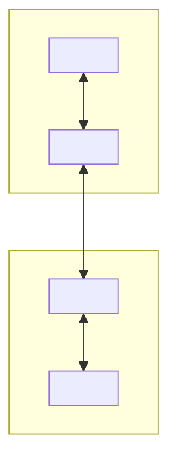

# Documentation System — Handoff & Bootstrap Guide

> **What this is:** A portable, project-agnostic specification for a two-tier markdown
> documentation system. Hand this single file to a fresh agent in a *new* project and it
> can reproduce the entire scaffold, then fill it in with that project's specifics.
>
> **What this is NOT:** Project content. Every concrete name, technology, metric, and
> decision below has been replaced with a `<placeholder>` or _italic guidance_. Nothing
> from the originating project is carried over — only the **conventions**.

---

## 1. Instructions for the receiving agent

You are setting up a documentation scaffold in a new project. Do the following:

1. Create the file tree in **Section 3** relative to the repo root.
2. For each file, use the **templated content** provided in Section 4 verbatim as a starting point.
3. Replace every `<placeholder>` and every _italic guidance line_ with real, project-specific
   content. Gather that content from the user, the repo, and `CLAUDE.md`. **Do not leave
   placeholders in finished docs, and do not invent specifics you haven't confirmed** — put
   unknowns in the **Open Questions** tables instead.
4. Add the `## Documentation` block from **Section 5** to the project's `CLAUDE.md`.
5. Keep the example IDs' *format* (`FR-01`, `US-01`, `TC-01`, `ADR-001`, `P-01`) but replace the
   example *content*.

The templates encode the conventions. Preserve the conventions; swap the specifics.

---

## 2. Conventions that apply to every file

These are the rules that make this a *system* rather than a pile of files. Carry all of them:

1. **Two tiers.** System-wide design lives in `docs/`. Feature-scoped design lives in
   `features/NNN-<slug>/`, created by copying `features/_template/`. `docs/INDEX.md` is the router.
2. **Metadata header.** Every doc opens with a blockquote carrying `> **Status:**` and/or
   `> **Last updated:**`.
3. **Standard sub-formats.** Decisions use **ADR** format. Requirements use **EARS** syntax.
   Test approach uses a **test pyramid**. Uncertainty goes in an **Open Questions** table with
   columns `# | Question | Owner | Resolution`.
4. **Explicit lifecycle rules.** Each system doc states when it gets updated; `INDEX.md` records
   these. The decision log is **append-only**.
5. **Templates over freeform.** New features are always scaffolded from `_template/` so every
   feature is documented identically.
6. **Cross-linking.** Docs reference each other by relative path; `INDEX.md` maps the relationships.
7. **Referenceable numbered IDs.** `FR-`, `US-`, `TC-`, `ADR-`, `P-` so tests trace to
   requirements trace to specs.

---

## 3. File tree to create

```text
/
├── CLAUDE.md                          # add the ## Documentation block (Section 5)
├── docs/
│   ├── INDEX.md                       # router: when to use which doc + lifecycle
│   ├── HLD.md                         # system "what": components, boundaries, flows
│   ├── ARCHITECTURE.md                # system "why": principles, constraints, risks
│   ├── DESIGN_DECISIONS.md            # append-only ADR log
│   ├── API_SPECIFICATION.md           # external API surface (omit if no external API)
│   ├── TEST_STRATEGY.md               # pyramid, tooling, quality gates, CI
│   └── NON_FUNCTIONAL_TESTING.md      # perf, scalability, reliability, a11y, security
└── features/
    ├── FEATURES.md                    # feature index + naming + status legend
    └── _template/                     # copy this folder per feature
        ├── SPEC.md
        ├── REQUIREMENTS.md
        ├── DESIGN.md
        ├── TEST_CASES.md
        └── PROMPT.md
```

> Drop any doc that doesn't fit the project (e.g. omit `API_SPECIFICATION.md` if there is no
> external API), but keep the two-tier shape and `INDEX.md`.

---

## 4. Templated file contents

Each block below is the starting content for one file. Copy the content *inside* the fence into
the named file, then fill in placeholders.

### 4.1 `docs/INDEX.md`

````markdown
# <Project> — Architecture Documentation Index

This folder covers **system-wide** design and decisions. Feature-scoped design lives in
`features/NNN-<slug>/DESIGN.md`.

## When to Use Which Document

| Document | Use it when you need to… |
| -------- | ------------------------ |
| [`HLD.md`](./HLD.md) | Understand the overall system: major components, boundaries, and data flows |
| [`ARCHITECTURE.md`](./ARCHITECTURE.md) | Understand the design principles, patterns, and constraints that govern all decisions |
| [`DESIGN_DECISIONS.md`](./DESIGN_DECISIONS.md) | Record or review a key architectural decision, including alternatives and trade-offs |
| [`API_SPECIFICATION.md`](./API_SPECIFICATION.md) | Define or reference the external API — endpoints, request/response shapes, auth |
| [`TEST_STRATEGY.md`](./TEST_STRATEGY.md) | Understand the test approach, pyramid, tooling, coverage thresholds, and CI gates |
| [`NON_FUNCTIONAL_TESTING.md`](./NON_FUNCTIONAL_TESTING.md) | Performance budgets, scalability targets, reliability scenarios, accessibility |

## Relationship to Feature Docs

```
docs/TEST_STRATEGY.md            ← how we test (tools, pyramid, quality gates)
docs/NON_FUNCTIONAL_TESTING.md   ← perf, scalability, reliability, a11y
features/NNN/REQUIREMENTS.md     ← acceptance criteria (EARS format)
features/NNN/TEST_CASES.md       ← explicit scenarios, test data, pass/fail
```

## Relationship to Architecture Docs

```
docs/HLD.md              ← system-wide "what" (components, boundaries)
docs/ARCHITECTURE.md     ← system-wide "why" (principles, constraints)
features/NNN/DESIGN.md   ← feature-level detail (design, data model, flows)
```

## Document Lifecycle

- **HLD** and **ARCHITECTURE** are updated when the system topology or principles change.
- **DESIGN_DECISIONS** is append-only — never edit past entries, only add new ones.
- **API_SPECIFICATION** stays in sync with the actual route definitions / generated spec.
- **TEST_STRATEGY** is updated when tooling, coverage thresholds, or CI gates change.
- **NON_FUNCTIONAL_TESTING** is updated as performance budgets and targets are set or revised.
````

**Adapt:** project name; add/remove rows to match which docs you kept.

### 4.2 `docs/HLD.md`

````markdown
# High-Level Design: <Project>

> **Last updated:** <YYYY-MM-DD>
> **Status:** draft | reviewed | approved

## System Overview

_One paragraph: what the system is, its core architectural shape, and any defining constraint._

## Component Map



## Component Responsibilities

| Component | Responsibility |
| --------- | -------------- |
| **<Component>** | _What it owns_ |
| **<Component>** | _What it owns_ |

## Data Flow: <Primary Operation>

```mermaid
sequenceDiagram
    participant User
    participant <Component>
    participant <Component>
    User->><Component>: <action>
    <Component>->><Component>: <step>
    <Component>-->>User: <result>
```

## Deployment Topology

| Environment | <Concern> | <Concern> | <Concern> |
| ----------- | --------- | --------- | --------- |
| Local dev | _value_ | _value_ | _value_ |
| Production | _value_ | _value_ | _value_ |

## Key Boundaries

- _State the inviolable boundaries — what must never call what, what must never cross a layer._

## Open Questions

| # | Question | Owner | Resolution |
|---|----------|-------|------------|
| 1 | _?_ | — | — |
````

**Adapt:** real components, tiers, and flows. Keep the Mermaid diagrams, boundaries section, and Open Questions table.

### 4.3 `docs/ARCHITECTURE.md`

````markdown
# Architecture: <Project>

> **Last updated:** <YYYY-MM-DD>

## Guiding Principles

_Numbered, each a bolded name + one-sentence rule. These govern every downstream decision._

1. **<Principle>** — _what it means in practice._
2. **<Principle>** — _what it means in practice._

## Architectural Patterns

### <Pattern Name>

_Describe the pattern and where it applies. Add a small diagram or flow if it helps._

## Scalability Considerations

| Concern | Approach |
| ------- | -------- |
| _concern_ | _how it's addressed_ |

## Constraints

- **<Constraint>** — _the hard rule and why it exists._

## Dependency Risk

| Dependency | Risk | Mitigation |
| ---------- | ---- | ---------- |
| _dependency_ | _what could go wrong_ | _how it's contained_ |
````

**Adapt:** principles and constraints are the heart of this file — make them specific and enforceable. The Dependency Risk table is where beta/immature tech gets flagged.

### 4.4 `docs/DESIGN_DECISIONS.md`

````markdown
# Design Decisions: <Project>

> This is an **append-only** log. Never edit or delete past entries — only add new ones.
> Format each entry as an ADR (Architecture Decision Record).

---

## ADR-001: <Decision title>

**Date:** <YYYY-MM-DD>
**Status:** Proposed | Accepted | Superseded by ADR-NNN

### Context

_The forces at play: the problem, requirements, and constraints that demand a decision._

### Decision

_The choice made, stated as a directive._

### Alternatives Considered

| Alternative | Reason Rejected |
| ----------- | --------------- |
| _option_ | _why not_ |

### Consequences

- ✅ _positive outcome_
- ⚠️ _cost, risk, or follow-up the decision creates_

---

<!-- New ADRs go below this line, following the same format -->
````

**Adapt:** replace ADR-001 with a real first decision. Never rewrite history — supersede instead.

### 4.5 `docs/API_SPECIFICATION.md`

````markdown
# API Specification: <Project> <API Name>

> **Runtime:** <framework>
> **Audience:** _who consumes this API (and, if relevant, who does NOT)_
> **Spec:** _how the machine-readable spec is generated, if any_
> **Last updated:** <YYYY-MM-DD>

## Base URL

| Environment | Base URL |
| ----------- | -------- |
| Local dev | `http://localhost:<port>/api` |
| Production | TBD |

## Authentication

_State the auth method, or mark TBD and link the ADR that will record it._

```
Authorization: Bearer <token>
```

## Conventions

- Request/response bodies are `application/json`
- Timestamps use ISO 8601: `<YYYY-MM-DDThh:mm:ssZ>`
- IDs are <UUID | other>
- Errors follow <error format, e.g. RFC 7807 Problem Details>:

```json
{ "type": "...", "title": "...", "status": 0, "detail": "..." }
```

## Versioning

_State the versioning policy and the prefix (e.g. `/v1/`)._

---

## Endpoints

> No endpoints defined yet. Add sections below as routes are implemented.

### Template

```
## <Resource>

### GET /api/<resource>
Brief description.

**Response 200**
{ ... }

### POST /api/<resource>
Brief description.

**Request body**
{ ... }

**Response 201**
{ ... }
```
````

**Adapt:** or delete this file entirely if the project has no external API.

### 4.6 `docs/TEST_STRATEGY.md`

````markdown
# Test Strategy: <Project>

> **Last updated:** <YYYY-MM-DD>

## Test Pyramid

```
        ▲
       /E2E\          <e2e tool> — critical user journeys only
      /──────\
     /Integr- \       <integration tool> — cross-module interactions
    /──────────\
   /  Unit Tests \    <unit tool> — pure functions, transforms
  /──────────────\
```

| Layer | Tool | Scope | Target Coverage |
| ----- | ---- | ----- | --------------- |
| Unit | <tool> | _pure functions, transforms_ | High — ≥ <N>% on business logic |
| Integration | <tool> | _cross-module / data-layer flows_ | Medium — key integration points |
| E2E | <tool> | _complete journeys in a real environment_ | Low — happy paths + critical failures |

## Tooling

| Tool | Purpose |
| ---- | ------- |
| <tool> | _what it's for_ |

## What to Test at Each Layer

### Unit Tests
- _list_

### Integration Tests
- _list_

### E2E Tests
- _critical journeys_

## Quality Gates

These must pass before merging to the main branch:

- [ ] All unit and integration tests pass
- [ ] No type errors
- [ ] Formatting/lint passes
- [ ] E2E tests pass on CI for affected journeys

## Coverage

- Measured on unit + integration tests only
- Minimum threshold: **<N>%** on <key directories>

## Test File Conventions

| Test type | Location | File naming |
| --------- | -------- | ----------- |
| Unit | Co-located with source | `<module>.test.<ext>` |
| Integration | `<dir>/__tests__/` | `<module>.integration.test.<ext>` |
| E2E | `e2e/` | `<journey>.spec.<ext>` |

## CI Pipeline (intended)

```
push / PR
  └── lint + typecheck
  └── unit + integration tests
  └── E2E tests (headless)
  └── build
```

## Out of Scope

- _what you are deliberately NOT testing at this stage_
````

**Adapt:** real tool names and thresholds. Keep the pyramid, quality-gate checklist, and conventions table.

### 4.7 `docs/NON_FUNCTIONAL_TESTING.md`

````markdown
# Non-Functional Testing: <Project>

> **Last updated:** <YYYY-MM-DD>

## Scope

Cross-cutting quality attributes: performance, scalability, reliability, accessibility, security.
Functional test cases live per-feature in `features/NNN/TEST_CASES.md`.

---

## Performance

| Metric | Target | Measurement |
| ------ | ------ | ----------- |
| _metric_ | _target_ | _how measured_ |

## Scalability

| Concern | Threshold to test | Approach |
| ------- | ----------------- | -------- |
| _concern_ | _threshold_ | _how tested_ |

## Reliability

| Scenario | Expected outcome | Test type |
| -------- | ---------------- | --------- |
| _scenario_ | _expected_ | _test type_ |

## Accessibility

| Standard | Target |
| -------- | ------ |
| _standard_ | _target_ |

## Security (non-functional surface)

| Area | Requirement |
| ---- | ----------- |
| _area_ | _requirement_ |

## Open Questions

| # | Question | Owner | Resolution |
|---|----------|-------|------------|
| 1 | _?_ | — | — |
````

**Adapt:** put real numbers where you have them; everything else goes in Open Questions.

### 4.8 `features/FEATURES.md`

````markdown
# <Project> — Feature Index

Each feature lives in its own numbered folder under `features/`. Copy `_template/` to start a new feature.

## Folder Naming Convention

```
features/<NNN>-<kebab-case-name>/
```

- `NNN` — zero-padded three-digit sequence number (e.g. `001`, `042`)
- `<kebab-case-name>` — short, descriptive slug matching the feature title

## Files per Feature

| File | Purpose |
| ---- | ------- |
| `SPEC.md` | Technical requirements, behaviors, constraints, and success criteria |
| `REQUIREMENTS.md` | User stories and acceptance criteria (EARS format) |
| `DESIGN.md` | Architecture, data models, system interactions, diagrams |
| `TEST_CASES.md` | Explicit test scenarios, test data, and pass/fail criteria |
| `PROMPT.md` | Pre-written agent prompts for code generation within the feature |

## Status Legend

| Status | Meaning |
| ------ | ------- |
| `planning` | Requirements and design being defined |
| `ready` | Spec complete, ready to implement |
| `active` | Currently in development |
| `complete` | Shipped and merged |
| `paused` | Deferred or blocked |

---

## Feature Index

| # | Feature | Status | Folder |
| - | ------- | ------ | ------ |
| — | *(no features yet — add rows as features are defined)* | — | — |
````

**Adapt:** project name only. This file is otherwise reusable as-is.

### 4.9 `features/_template/SPEC.md`

````markdown
# Spec: <Feature Name>

> **Status:** planning | ready | active | complete | paused
> **Feature folder:** `features/NNN-<slug>/`

## Overview

_One paragraph describing what this feature is and why it exists._

## Goals

- _What this feature must achieve_

## Non-Goals

- _What is explicitly out of scope_

## Functional Requirements

### FR-01: <Requirement title>

_Description of the requirement._

### FR-02: <Requirement title>

_Description of the requirement._

## Constraints

- _Technical, UX, or business constraints_

## Success Criteria

- [ ] _Measurable condition that defines "done"_
- [ ] _Another measurable condition_

## Open Questions

| # | Question | Owner | Resolution |
|---|----------|-------|------------|
| 1 | _?_ | — | — |
````

### 4.10 `features/_template/REQUIREMENTS.md`

````markdown
# Requirements: <Feature Name>

> EARS format — Easy Approach to Requirements Syntax
> Patterns: **Ubiquitous** | **Event-driven** | **Unwanted behaviour** | **State-driven** | **Optional**

## User Stories

### US-01: <Story title>

**As a** <role>,
**I want to** <action>,
**So that** <benefit>.

#### Acceptance Criteria

- **WHEN** <trigger>, **THE SYSTEM SHALL** <response>.
- **IF** <precondition>, **THEN THE SYSTEM SHALL** <response>.
- **WHILE** <state>, **THE SYSTEM SHALL** <response>.

---

### US-02: <Story title>

**As a** <role>,
**I want to** <action>,
**So that** <benefit>.

#### Acceptance Criteria

- **THE SYSTEM SHALL** <always-on requirement>.

---

## Edge Cases & Error States

| Scenario | Expected Behaviour |
| -------- | ------------------ |
| _Describe edge case_ | _Describe expected outcome_ |

## Out of Scope

- _User story or scenario explicitly excluded_
````

### 4.11 `features/_template/DESIGN.md`

````markdown
# Design: <Feature Name>

> **Status:** draft | reviewed | approved
> **Last updated:** <YYYY-MM-DD>

## Architecture Overview

_How this feature fits into the overall architecture. Reference the relevant layers._

## Data Model

### New / Modified Data Structures

```
<schema excerpt — keep the authoritative definition in its source-of-truth location>
```

### Derived Validation / Types

_List any generated or derived schemas/types this feature uses. Note how they are produced._

## Component Structure

```
<dir>/
└── <component or module tree this feature adds>
```

## Data Flow

```mermaid
sequenceDiagram
    participant User
    participant <Component>
    participant <Component>
    User->><Component>: action
    <Component>->><Component>: step
```

## State Management

_Which stores/queries/collections this feature uses, and why._

## API Surface (if applicable)

| Method | Path | Description |
| ------ | ---- | ----------- |
| `GET`  | `/...` | _description_ |

## Key Design Decisions

| Decision | Alternatives Considered | Rationale |
| -------- | ----------------------- | --------- |
| _Decision_ | _Alt A, Alt B_ | _Why this approach_ |

## Diagrams

_Add ER, state-machine, or component-tree diagrams as needed._
````

**Adapt:** the data-model and state-management sections reference your stack's source-of-truth layer — name it generically here, concretely in real features.

### 4.12 `features/_template/TEST_CASES.md`

````markdown
# Test Cases: <Feature Name>

> Feature-scoped functional test scenarios. Non-functional testing lives in `docs/NON_FUNCTIONAL_TESTING.md`.
> Acceptance criteria (EARS) live in `REQUIREMENTS.md` — this file covers explicit scenarios and test data.

## TC-01: <Scenario title>

**User story ref:** US-01
**Type:** Unit | Integration | E2E

| Step | Action | Expected result |
| ---- | ------ | --------------- |
| 1 | _action_ | _outcome_ |
| 2 | _action_ | _outcome_ |

**Test data:**
```
<seed data / fixtures / preconditions>
```

**Pass criteria:** _what constitutes a pass_
**Fail criteria:** _what constitutes a fail_

---

## TC-02: <Scenario title> (Edge Case)

**User story ref:** US-01
**Type:** Unit | Integration | E2E

| Step | Action | Expected result |
| ---- | ------ | --------------- |
| 1 | _action_ | _outcome_ |

**Pass criteria:** _pass condition_
**Fail criteria:** _fail condition_

---

## TC-03: <Scenario title> (Error State)

**User story ref:** US-02
**Type:** Unit | Integration | E2E

| Step | Action | Expected result |
| ---- | ------ | --------------- |
| 1 | _trigger error_ | _graceful handling / recovery_ |

**Pass criteria:** _pass condition_
**Fail criteria:** _fail condition_

---

## Test Data Summary

| Dataset | Description | Location |
| ------- | ----------- | -------- |
| _name_ | _what it represents_ | `e2e/fixtures/` or inline |

## Coverage Checklist

- [ ] Happy path covered
- [ ] Edge cases from `REQUIREMENTS.md` covered
- [ ] Error states from `REQUIREMENTS.md` covered
- [ ] _Any project-critical cross-cutting scenario (e.g. offline, concurrency) covered_
````

### 4.13 `features/_template/PROMPT.md`

````markdown
# Prompts: <Feature Name>

> Each section is a discrete, self-contained prompt to be fed to the agent.
> Run them in order unless noted otherwise. Reference prior outputs where indicated.

---

## P-01: <Task title>

**Context files to load:**
- `features/NNN-<slug>/SPEC.md`
- `features/NNN-<slug>/DESIGN.md`
- _(add relevant source files)_

**Prompt:**

```
<Full prompt. Be explicit about: what to build, which files to create/modify,
which conventions to follow (see CLAUDE.md), the expected output, and constraints.>
```

**Expected output:** _what this prompt should produce._

---

## P-02: Tests

**Context files to load:**
- _(files produced by earlier prompts)_

**Prompt:**

```
Write tests for the code produced in P-01.
Cover: happy path, edge cases from REQUIREMENTS.md, and error states.
Follow existing test patterns in the project.
```

**Expected output:** Test files alongside the implementation.
````

---

## 5. Block to add to the new project's `CLAUDE.md`

```markdown
## Documentation

This project uses a two-tier documentation system. Read `docs/INDEX.md` first.

- **System-wide design** lives in `docs/` (INDEX, HLD, ARCHITECTURE, DESIGN_DECISIONS,
  API_SPECIFICATION, TEST_STRATEGY, NON_FUNCTIONAL_TESTING).
- **Feature-scoped design** lives in `features/NNN-<slug>/`, created by copying
  `features/_template/` (SPEC, REQUIREMENTS, DESIGN, TEST_CASES, PROMPT).

### Rules
- Before building a feature, create `features/NNN-<slug>/` from `_template/`, fill
  SPEC → REQUIREMENTS → DESIGN → TEST_CASES, and add a row to `features/FEATURES.md`.
- `docs/DESIGN_DECISIONS.md` is append-only — add a new ADR, never edit past ones.
- Record any architectural choice as an ADR; record uncertainty in an Open Questions table.
- Requirements use EARS syntax; decisions use ADR format; IDs (FR-/US-/TC-/ADR-/P-) are referenceable.
- Keep `docs/` in sync with reality — update HLD/ARCHITECTURE when topology or principles change.
```

---

## 6. Setup checklist for the receiving agent

- [ ] Created `docs/` with INDEX + the system docs that apply to this project
- [ ] Created `features/FEATURES.md` and `features/_template/` (all 5 files)
- [ ] Replaced every `<placeholder>` and _italic guidance_ with real content (or moved unknowns to Open Questions)
- [ ] Added the `## Documentation` block to `CLAUDE.md`
- [ ] Wrote a real ADR-001 capturing the first/foundational architectural decision
- [ ] Confirmed every doc has a `> Status:` / `> Last updated:` header
- [ ] Confirmed `INDEX.md` lists exactly the docs that exist
