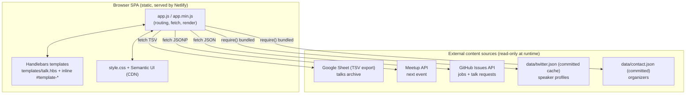
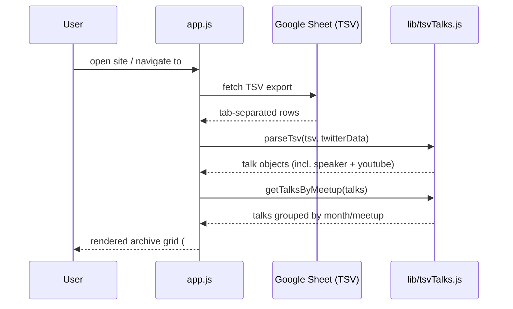

# High-Level Design: BrisJS Website

> **Last updated:** 2026-06-11
> **Status:** reviewed
> **Scope:** Documents the **current** (pre-migration) system as the baseline. The migration
> target (Strapi-backed CMS) is tracked as Proposed ADRs in [`DESIGN_DECISIONS.md`](./DESIGN_DECISIONS.md)
> and in [`features/001-strapi-content-modeling/`](../features/001-strapi-content-modeling/).

## System Overview

The BrisJS website (live at `brisjs.org`) is a fully **client-side single-page application**.
There is no backend and no database: a single `index.html` loads a Browserify bundle
(`app.min.js`) that, at runtime in the browser, fetches content from several external sources,
renders it with Handlebars templates, and switches "pages" via URL-hash routing. The site is
built locally and deployed as static assets to Netlify on push to `master`.

The defining constraint is **zero owned infrastructure**: all dynamic content lives in
third-party systems (a Google Sheet, Meetup, GitHub, a pre-fetched Twitter cache), and the
deployed artdefact is just static files.

## Component Map

## Component Responsibilities

| Component | Responsibility |
| --------- | -------------- |
| **`app.js`** | App entry: hash routing (`hashChange`), fetches each data source, compiles + injects templates (`templateContent`), renders single-talk pages |
| **`lib/tsvTalks.js`** | Pure transforms: parse the talks TSV into talk objects, parse speakers/YouTube, group talks by meetup, compute unique speakers |
| **`templates/talk.hbs`** | Single-talk view: speaker cards, YouTube embed, slides/code/video buttons |
| **Inline `#template-*`** | Archive grid, requested talks, jobs, contact cards — compiled from `<script type="text/x-handlebars-template">` blocks in `index.html` |
| **`config.json`** | Holds the data-source URLs (talks sheet, Meetup events, GitHub issues) |
| **`data/twitter.json`** | Committed cache of speaker Twitter profiles, regenerated by `tools/build-twitter` |
| **`data/contact.json`** | Committed list of organizers |
| **Netlify** | Builds (or serves prebuilt assets) and hosts the static site on push to `master` |

## Data Flow: Load Talks Archive

## Deployment Topology

| Environment | Build | Hosting | Trigger |
| ----------- | ----- | ------- | ------- |
| Local dev | `npm start` (Beefy bundles `app.js` → `app.min.js`, hot reload) | localhost | manual |
| Production | `npm run build` (Browserify + uglify-es) producing `app.min.js`, committed/served as static | Netlify | push to `master` |

## Key Boundaries

- **Everything runs in the browser.** There is no server-side code path; nothing in the repo
  executes on a server beyond static file hosting.
- **No secrets in the repo.** The Meetup URL carries a pre-baked signature/`sig` query param;
  there are no private keys. Any future CMS auth must keep secrets out of the client bundle.
- **External content is read-only at runtime.** The site never writes back to its sources;
  content is edited out-of-band (Google Sheet, GitHub issues, `data/*.json`).

## Open Questions

| # | Question | Owner | Resolution |
|---|----------|-------|------------|
| 1 | The repo `CNAME` contains `bris.js.org`, but the live site and README use `brisjs.org`. Is the `CNAME` stale/incorrect, and does it need correcting before any deploy changes? | — | — |
| 2 | The Meetup events URL embeds a `sig`/`sig_id` signature. Is it still valid, and what is its longevity / who can regenerate it? | — | Resolved 2026-06-12 (BUILD_WORKFLOW T0.1): probe returned **HTTP 404** — the URL is dead, so the live site's "next event" is already broken in production. Confirms the Strapi-managed-events decision (feature 001 Q3) |
| 3 | `data/twitter.json` is a committed snapshot regenerated via `tools/build-twitter`, which uses the deprecated Twitter API v1. How stale is it, and is regeneration still possible? | — | — |
| 4 | The talks archive's source of truth is a single Google Sheet owned by an individual. What is the access/continuity risk, and should it be migrated first? | — | — |
