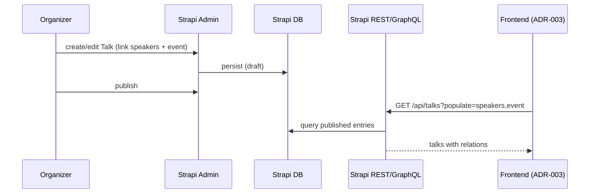
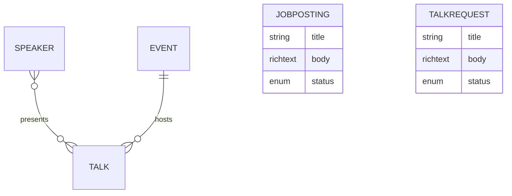

# Design: Strapi Content Modeling

> **Status:** draft
> **Last updated:** 2026-06-11

## Architecture Overview

This feature defines the Strapi content model that becomes the single source of truth for
BrisJS content (ADR-002). Strapi auto-generates a REST (and optional GraphQL) API from these
types; the future frontend (ADR-003) consumes that API in place of today's direct fetches to
Google Sheets / Meetup / GitHub. This document specifies the **target shape** only — no schema
files are created here.

## Data Model

### Collection Types

```
Talk
  title         string        (required)
  slug          uid           (auto-generated from title — route key for /talks/<slug>)
  legacyId      integer       (optional, unique — id from the legacy sheet; powers #talk-<id> redirects)
  date          date          (required)
  synopsis      richtext      (optional)
  youtubeUrl    string/url    (optional)
  slidesUrl     string/url    (optional)
  codeUrl       string/url    (optional)
  speakers      relation      Talk has-and-belongs-to-many Speaker
  event         relation      Talk belongs-to-one Event

Speaker
  name          string        (required)
  bio           richtext      (optional)
  photo         media         (optional, single image)
  website       string/url    (optional)
  twitter       string        (optional — handle; deprecated API, see Open Q5)
  talks         relation      inverse of Talk.speakers

Event
  name          string        (required)
  dateTime      datetime      (required)
  venue         string        (optional — plain field for v1; no shared component)
  description   richtext      (optional)
  talks         relation      inverse of Talk.event

JobPosting
  title         string        (required)
  body          richtext      (required)
  submittedDate date          (optional)
  status        enumeration   (open | filled | closed)

TalkRequest
  title         string        (required)
  body          richtext      (required)
  submittedDate date          (optional)
  status        enumeration   (open | scheduled | declined)

Organizer
  name          string        (required)
  role          string        (optional)
  bio           richtext      (optional)
  photo         media         (optional, single image)
  twitter       string/url    (optional)
  email         email         (optional)
  order         integer       (optional — display order)
```

### Single Types

```
HomePage
  heroTagline   string        (optional — hero/banner line)
  intro         richtext      (optional — "who we are")
  whatWeDo      richtext      (optional — "what we do")

CodeOfConduct
  body          richtext      (required)

FindUs
  venueName     string
  address       string
  mapEmbed      string/text
  parking       richtext
  accessibility richtext
```

> `Organizer` and `HomePage` were added so the contact list and the home-page intro copy are
> CMS-editable rather than hard-coded. See the Content & Rendering Map in
> `features/002-astro-frontend/DESIGN.md` for the full dynamic-vs-static split.

### Derived Validation / Types

Strapi generates the REST/GraphQL schema and admin validation from these definitions. If the
frontend stack (ADR-003) is typed, generate API types from Strapi's OpenAPI/GraphQL schema
rather than hand-writing them. Source of truth = the Strapi content-type definitions.

## Component Structure

```
(target Strapi project — created in a later step, shown for orientation only)
src/api/
├── talk/content-types/talk/schema.json
├── speaker/content-types/speaker/schema.json
├── event/content-types/event/schema.json
├── job-posting/content-types/job-posting/schema.json
├── talk-request/content-types/talk-request/schema.json
├── code-of-conduct/content-types/code-of-conduct/schema.json   (single type)
└── find-us/content-types/find-us/schema.json                   (single type)
```

## Data Flow



## State Management

Content lives in Strapi's database (managed by Strapi Cloud). Draft/publish state gates what
the public API returns. The frontend treats the Strapi API as read-only at runtime; writes
happen only through the Strapi admin.

## API Surface (generated by Strapi)

| Method | Path | Description |
| ------ | ---- | ----------- |
| `GET` | `/api/talks?populate=speakers,event` | List published talks with relations |
| `GET` | `/api/talks/:id?populate=*` | Single talk (for the talk detail view) |
| `GET` | `/api/speakers?populate=photo` | List speakers |
| `GET` | `/api/events?populate=talks` | List events with their talks |
| `GET` | `/api/job-postings` | List job postings |
| `GET` | `/api/talk-requests` | List talk requests |
| `GET` | `/api/organizers?populate=photo` | List organizers (contact page) |
| `GET` | `/api/home-page` | Home intro copy single type |
| `GET` | `/api/code-of-conduct` | Code of Conduct single type |
| `GET` | `/api/find-us` | Find Us single type |

## Migration Mapping (old source → new type)

| Current source | Field(s) | → Strapi type.field |
| -------------- | -------- | ------------------- |
| Google Sheet TSV col 0 `id` | talk id | `Talk.legacyId` (slug auto-generated from title) |
| TSV col 1 `date` (epoch ms) | date | `Talk.date` (coerce ms → date) |
| TSV col 2 `title` | title | `Talk.title` |
| TSV col 3/4 `speakers`/`twitters` | names + handles | `Speaker.name` / `Speaker.twitter` (split CSV → related Speaker records) |
| TSV col 5 `youtube` | watch URL | `Talk.youtubeUrl` |
| TSV col 6 `slides` | URL | `Talk.slidesUrl` |
| TSV col 7 `code` | URL | `Talk.codeUrl` |
| TSV col 8 `synopsis` | text | `Talk.synopsis` |
| Meetup API event | name/time/venue/desc | `Event.*` |
| `data/twitter.json` | profile fields | `Speaker.bio` / `Speaker.photo` / `Speaker.website` |
| `data/contact.json` | name/role/bio/twitter/email/photo | `Organizer.*` |
| GitHub issue (`Jobs / Employment`) | title/body/updated_at | `JobPosting.*` |
| GitHub issue (`Talk Requests`) | title/body/updated_at | `TalkRequest.*` |
| `index.html` home intro ("who we are" / "what we do") | static copy | `HomePage.intro` / `HomePage.whatWeDo` |
| `index.html` Code of Conduct | static copy | `CodeOfConduct.body` |
| `index.html` Find Us | static copy | `FindUs.*` |

## Key Design Decisions

| Decision | Alternatives Considered | Rationale |
| -------- | ----------------------- | --------- |
| Speakers as a first-class related type | Embed speaker fields on each talk | Removes duplication; one speaker → many talks; matches `getUniqueUsers` intent in `lib/tsvTalks.js` |
| Dedicated `Organizer` type | Reuse `Speaker`; single shared "Person" type | **Resolved** — organizers have role/email/order not on speakers; a small dedicated type is clearer and keeps the contact list CMS-editable |
| `HomePage` single type for intro copy | Hard-code intro in Astro | Keeps home "who we are / what we do" copy editable without a deploy |
| Events managed in Strapi | Keep live Meetup API for archive | Removes the opaque Meetup `sig` dependency for historical display; upcoming-event sync is Open Q3 |
| Jobs/requests as CMS entries | Keep GitHub issues | Moderated, structured, no GitHub-label coupling |

## Diagrams

### Entity relationships



## Migration findings (from the T1.2 importer run, 2026-06-12)

Verified against a real import of the 227-row legacy archive (`docs/BUILD_WORKFLOW.md` T1.2):

- **Duplicate `legacyId`s in the source.** Ids 189, 206, 207, 208 each appear on two
  *different* talks. The importer keeps the first occurrence's original id (preserving
  `#talk-<id>` redirects — feature 004) and assigns deterministic synthetic ids (`900000+`) to
  later collisions. Feature 004's redirect map must use the importer's id mapping, not assume
  ids are unique.
- **`Talk.slug` is generated by the importer** (`slugify(title)-legacyId`): Strapi's document
  service does not auto-populate `uid` fields (only the admin content-manager does), so the
  importer derives the slug deterministically.
- **Photos are not imported.** `Speaker.photo` / `Organizer.photo` are media fields; legacy
  data only has image URLs (gravatar / Twitter CDN) which need an upload step — flagged for
  manual upload (bios, websites, twitter handles ARE imported).
- **`FindUs.mapEmbed` left empty** — the legacy `index.html` uses a static SVG, not an
  embeddable map; flagged for manual entry. The street address is a best-effort composite.
- **One stray trailing TSV row** (date only, no id/title) is dropped → 227 talks, not 228.

## Open Design Questions

| # | Question | Owner | Resolution |
|---|----------|-------|------------|
| 1 | Dedicated `Organizer` type vs reusing `Speaker`? | — | Resolved 2026-06-11: dedicated `Organizer` type |
| 2 | Keep a `legacyId` on `Talk` to preserve old `#talk-<id>` URLs / redirects? | — | Resolved 2026-06-11: yes — `Talk.legacyId` + `Talk.slug` (UID) added to the model |
| 3 | Model `venue` as a reusable Strapi **component** shared by Event and FindUs? | — | Resolved 2026-06-11: no — plain fields for v1; revisit if venue data grows |
