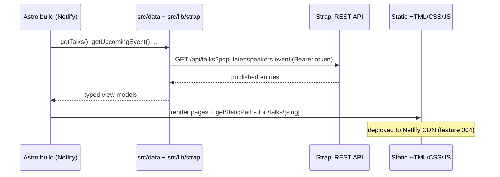

# Design: Astro Frontend

> **Status:** draft
> **Last updated:** 2026-06-11

## Architecture Overview

An Astro site that statically generates pages at build time from the Strapi REST API
(ADR-002, ADR-004). A single data-access layer wraps Strapi fetches and returns typed view
models; Astro pages and components consume those models. Output is static HTML/CSS/JS deployed
to Netlify (feature 004). The browser never calls Strapi directly — the API token is used only
during the build. **The current visual design is ported as-is** (carry over `style.css` and
the existing Semantic-UI look); any redesign is a separate future feature.

## Content & Rendering Map (dynamic vs static)

Derived from the current site (`index.html` pages + the runtime fetches in `app.js`). Default
bias: **content is CMS-driven** (Strapi, feature 001) so organizers can edit without a deploy;
only the **structural shell and chrome** are hard-coded in Astro. "For ease," anything that is
copy/content — even the home intro — is CMS-driven.

| Site area | Current source | Rendering | Source of truth |
| --------- | -------------- | --------- | --------------- |
| Global header / nav | `index.html` markup | **Astro (static)** | code — nav rarely changes |
| Footer | `index.html` markup | **Astro (static)** | code |
| Page layout / grid / hero structure + hero image | `style.css`, `images/` | **Astro (static)** | code + repo assets |
| Home hero tagline + "who we are" / "what we do" copy | `index.html` static text | **CMS** | `HomePage` single type |
| Upcoming / next event | Meetup API | **CMS** (Event marked upcoming) | `Event` — live-Meetup option is feature 001 Open Q3 |
| Talks archive (grouped) | Google Sheet | **CMS** | `Talk` + `Event` |
| Talk detail | Google Sheet + Twitter cache | **CMS** | `Talk` + `Speaker` |
| Speaker info | `data/twitter.json` | **CMS** | `Speaker` |
| Jobs | GitHub issues | **CMS** | `JobPosting` |
| Talk requests | GitHub issues | **CMS** | `TalkRequest` |
| Organizers / contact | `data/contact.json` | **CMS** | `Organizer` |
| Code of Conduct | `index.html` static text | **CMS** | `CodeOfConduct` single type |
| Find Us / venue (incl. parking, accessibility) | `index.html` static text | **CMS** | `FindUs` single type |
| SEO/meta defaults, 404, favicon | n/a | **Astro (static)** | code |

> Rule of thumb: **structure = Astro, content = Strapi.** If a non-technical organizer might
> reasonably want to change it, it's CMS-driven.

## Data Model

The frontend consumes the Strapi content types defined in feature 001 (Talk, Speaker, Event,
JobPosting, TalkRequest, Organizer, HomePage, CodeOfConduct, FindUs). It does not define new
persistent data; it defines **view models** mapped from the Strapi REST shape
(`{ data: [{ id, attributes }] }`).

### Derived Validation / Types

If TypeScript is used, generate API types from Strapi's OpenAPI/GraphQL schema (or define
narrow view-model types in the data layer) rather than hand-maintaining duplicates. The Strapi
content-type definitions remain the source of truth.

## Component Structure

```
src/
├── lib/
│   └── strapi.ts            # fetch wrapper (base URL + token from env), populate helpers
├── data/
│   ├── talks.ts             # getTalks(), getTalkBySlug(), groupByEvent()  (port of lib/tsvTalks.js logic)
│   ├── events.ts            # getUpcomingEvent(), getEvents()
│   ├── speakers.ts
│   ├── postings.ts          # jobs + talk requests
│   ├── organizers.ts        # getOrganizers()
│   └── pages.ts             # home-page, code-of-conduct, find-us single types
├── layouts/
│   └── BaseLayout.astro     # head/meta, header, footer, OG tags
├── components/
│   ├── TalkCard.astro
│   ├── SpeakerCard.astro
│   ├── EventBanner.astro
│   └── ResourceButtons.astro
├── pages/
│   ├── index.astro          # home: HomePage copy + upcoming event
│   ├── talks/index.astro    # archive grouped by event
│   ├── talks/[slug].astro   # talk detail (getStaticPaths)
│   ├── jobs.astro
│   ├── talk-requests.astro
│   ├── contact.astro        # organizers
│   ├── code-of-conduct.astro
│   └── find-us.astro
└── styles/
    └── global.css           # ported from the current style.css (+ Semantic UI as needed)
```

> Styling note: this feature **ports** the existing `style.css` and Semantic-UI-based look
> rather than introducing a new design system. Feature 005 (design refresh) replaces this later.

## Data Flow



## State Management

None at runtime — the site is static. "State" is the build-time content snapshot. Any
interactive bits (e.g. mobile nav, optional client-side talk filter) are isolated Astro
islands with local state only.

## API Surface (consumed, not exposed)

| Method | Path | Used by |
| ------ | ---- | ------- |
| `GET` | `/api/talks?populate=speakers,event` | archive + detail |
| `GET` | `/api/events?populate=talks` | home (upcoming) + events |
| `GET` | `/api/speakers?populate=photo` | speaker cards |
| `GET` | `/api/job-postings` | jobs page |
| `GET` | `/api/talk-requests` | talk-requests page |
| `GET` | `/api/organizers?populate=photo` | contact page |
| `GET` | `/api/home-page` | home intro copy |
| `GET` | `/api/code-of-conduct` / `/api/find-us` | static-content pages |

## Key Design Decisions

| Decision | Alternatives Considered | Rationale |
| -------- | ----------------------- | --------- |
| SSG (build-time fetch) | SSR via Netlify functions | Content site; SSG is faster, cheaper, simpler (ADR-005) |
| Single `src/lib/strapi` wrapper | Fetch inline per page | One place for base URL, token, error handling, populate |
| Port `lib/tsvTalks.js` grouping logic into `src/data/talks.ts` | Rewrite from scratch | Reuse proven grouping/parsing semantics; unit-testable |
| Port current `style.css` + Semantic UI look | New design system now | Migrate design faithfully first; redesign is a deferred feature |

## Diagrams

### Route map

```
/                      → home (HomePage copy + upcoming event)
/talks                 → archive grouped by event
/talks/[slug]          → talk detail (one per published talk)
/jobs                  → job postings
/talk-requests         → requested talks
/contact               → organizers
/code-of-conduct       → single type
/find-us               → single type
```

## Open Design Questions

| # | Question | Owner | Resolution |
|---|----------|-------|------------|
| 1 | TypeScript + generated Strapi types, or JS + hand-written view models? | — | Resolved 2026-06-11: TypeScript with hand-written narrow view-model types in `src/data` (don't block on codegen; revisit generated types later) |
| 2 | Talk slug source (title-derived vs `legacyId`) — must align with feature 004 redirects | — | Resolved 2026-06-11: `Talk.slug` UID for routes + `Talk.legacyId` for redirects (feature 001 model) |
| 3 | Port Semantic UI wholesale (CDN/local) vs extract only the used rules from `style.css`? | — | Resolved 2026-06-11: keep Semantic UI CDN + `style.css` verbatim for parity; extraction is feature 005's job |
