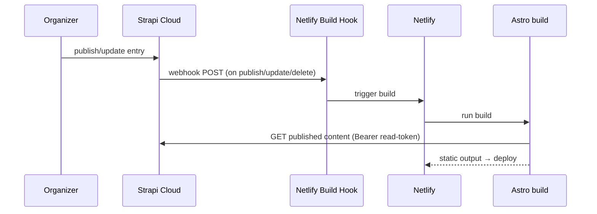

# Design: Strapi Backend Integration

> **Status:** draft
> **Last updated:** 2026-06-11

## Architecture Overview

Strapi runs on **Strapi Cloud** (free plan, ADR-002/ADR-005) and is the source of truth for
content. The content types from feature 001 are developed locally (Strapi dev project, schema
in code) and deployed to Cloud. The public REST API serves **published** content read-only to
the Astro build (feature 002). A publish webhook calls a Netlify build hook (feature 004) to
redeploy on change. Secrets live in platform env, never in the repo.

## Data Model

Owned by feature 001 (Talk, Speaker, Event, JobPosting, TalkRequest, CodeOfConduct, FindUs).
This feature creates/deploys those types and configures access to them; it adds no new types.

## Component Structure

```
(Strapi project — schema in code, deployed to Strapi Cloud)
src/api/<type>/...            # content types from feature 001
config/
├── server                    # base config
├── middlewares               # CORS allowed origins (Astro site/build)
└── (plugins)                 # users-permissions, etc.
scripts/
└── migrate-legacy.*          # one-off importer (feature 001 P-03 mapping)
```

## Data Flow: Publish → Live



## Roles, Permissions & Tokens

| Concern | Configuration |
| ------- | ------------- |
| Public role | `find` + `findOne` on Talk/Speaker/Event/JobPosting/TalkRequest/CodeOfConduct/FindUs; no write |
| Build token | API token, **read-only**, used by the Astro build; stored in Netlify env `STRAPI_API_TOKEN` |
| Draft/publish | Enabled on all collection types (feature 001); public API returns published only |
| Organizer accounts | Authenticated admin users (seats limited by free plan — Open Q4) |

## API Surface

Generated by Strapi from feature-001 types (see `docs/API_SPECIFICATION.md` and feature 001
DESIGN). This feature confirms the **base URL** (Strapi Cloud project URL) and that the public
endpoints return published entries only.

| Env var | Purpose | Stored in |
| ------- | ------- | --------- |
| `STRAPI_API_URL` | Strapi Cloud REST base (e.g. `https://<project>.strapiapp.com/api`) | Netlify env |
| `STRAPI_API_TOKEN` | Read-only build token | Netlify env |

## Webhook → Build Hook

- Strapi **webhook** subscribed to `entry.publish`, `entry.update`, `entry.unpublish`,
  `entry.delete` for public types.
- Target = the Netlify **build hook** URL (created in feature 004).
- Failures are logged in Strapi; a manual Netlify deploy remains the fallback.

## Migration

Run the importer (feature 001 P-03) against Strapi using an admin token: read the legacy
Google Sheet TSV, `data/twitter.json`, `data/contact.json`, and (optionally) GitHub-issue
jobs/requests; create entries per the feature-001 mapping; dedupe speakers by name; coerce
epoch-ms dates. Idempotent (upsert by a stable key such as `legacyId`/name).

## Key Design Decisions

| Decision | Alternatives Considered | Rationale |
| -------- | ----------------------- | --------- |
| Strapi Cloud free plan | Self-host now | ADR-002/005; validate model cheaply first, self-host later if needed |
| Read-only build token | Public unauthenticated API | Least privilege; revocable/rotatable without code change |
| Webhook → build hook | Scheduled rebuilds | Near-immediate publishing without polling |
| Schema-in-code + deploy | Configure only in Cloud UI | Reviewable, reproducible, supports the self-host escape hatch |

## Open Design Questions

| # | Question | Owner | Resolution |
|---|----------|-------|------------|
| 1 | Media storage within free-plan quota (Strapi media library vs external CDN)? | — | — |
| 2 | Should jobs/talk-requests be imported from GitHub issues, or started fresh in Strapi? | — | — |
| 3 | Webhook event set — include update/delete, or publish/unpublish only? | — | — |
