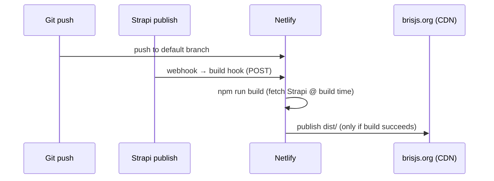

# Design: Netlify Deployment & Hosting

> **Status:** draft
> **Last updated:** 2026-06-11

## Architecture Overview

Netlify builds the Astro site (feature 002), which fetches content from Strapi Cloud (feature
003) at build time, and serves the static output from its CDN at `brisjs.org` (ADR-005). Two
triggers cause a build: a push to the default branch, and a content publish in Strapi (via a
Strapi webhook → Netlify build hook). Secrets live in Netlify env.

## Configuration

### `netlify.toml` (repo root)

```toml
[build]
  command = "npm run build"      # astro build
  publish = "dist"

[build.environment]
  NODE_VERSION = "20"            # pin a current LTS

# STRAPI_API_URL and STRAPI_API_TOKEN are set in the Netlify UI (env), not here.

[[redirects]]
  # legacy path redirects (non-hash) — examples; finalise with feature 002 slug scheme
  from = "/talks.html"
  to = "/talks"
  status = 301
```

### Environment variables (Netlify UI)

| Var | Purpose | Notes |
| --- | ------- | ----- |
| `STRAPI_API_URL` | Strapi Cloud REST base | from feature 003 |
| `STRAPI_API_TOKEN` | read-only build token | from feature 003; never committed |

### Build hook

A Netlify build hook (a POST URL) is created and handed to feature 003's Strapi webhook so
publishes trigger rebuilds.

## Data Flow: Two build triggers



## Legacy URL strategy

| Legacy URL | New target | Mechanism |
| ---------- | ---------- | --------- |
| `#talk-<id>` (hash route) | `/talks/<slug>` | Client-side shim on home/landing — hash can't be seen server-side; map `id`→slug (uses `legacyId` from feature 001/002) |
| Old path-style URLs (if any) | new Astro routes | `netlify.toml` `[[redirects]]` 301s |
| Unknown legacy talk id | `/talks` | shim fallback (no hard error) |

## Domain & DNS

- Canonical domain: **`brisjs.org`** (HTTPS, Netlify-managed cert).
- The repo `CNAME` currently reads `bris.js.org` — reconcile: confirm DNS, set the correct
  domain in Netlify, and update/remove the `CNAME` so there's a single canonical host
  (resolves `docs/HLD.md` Open Question 1).

## Deploy previews

Enable Netlify Deploy Previews for PRs (default Netlify behaviour once the repo is linked).

## Key Design Decisions

| Decision | Alternatives Considered | Rationale |
| -------- | ----------------------- | --------- |
| `netlify.toml` in repo | Configure only in UI | Reproducible, reviewable build config |
| Build hook + Strapi webhook | Scheduled rebuilds / manual | Near-immediate content publishing |
| Client shim for `#talk-<id>` | Drop legacy links | Hash fragments never reach the server; preserve inbound links |
| Fail build on missing content | Deploy partial site | Protect the live site from half-empty deploys |

## Open Design Questions

| # | Question | Owner | Resolution |
|---|----------|-------|------------|
| 1 | Reuse the existing Netlify project or create a new one for the Astro build? | — | — |
| 2 | Exact legacy URL inventory to redirect (beyond `#talk-<id>`)? | — | — |
| 3 | `CNAME`/DNS ownership and the cutover plan to avoid downtime? | — | — |
